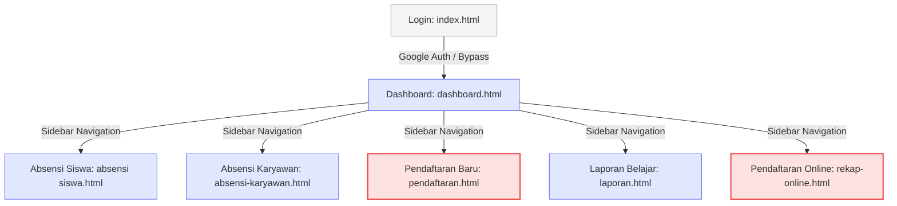
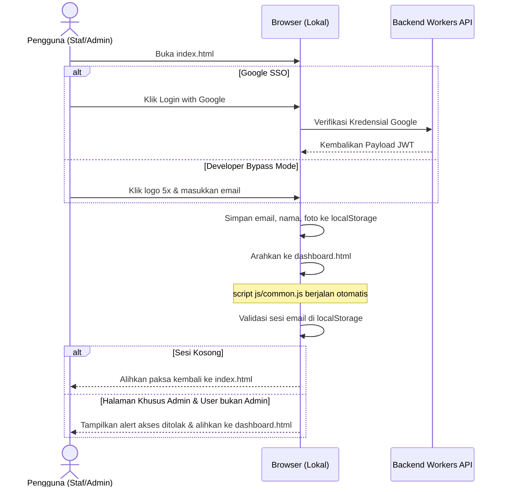

# Arsitektur Informasi (IA)
## Sistem Manajemen Akademik & Absensi LKP Insan Jaya

Dokumen ini merinci struktur informasi, navigasi, dan aliran data dalam aplikasi LKP Insan Jaya. Dokumen IA ini bertujuan untuk memberikan panduan jelas mengenai bagaimana konten dan fitur disusun untuk mempermudah navigasi pengguna serta pemeliharaan sistem.

---

## 1. Peta Situs (Sitemap) & Hirarki Halaman

Aplikasi ini menggunakan struktur multi-halaman statis (Jamstack) yang terintegrasi menggunakan navigasi sidebar dinamis yang dikelola oleh `js/common.js`.



### Tabel Rincian Halaman & Konten

| Berkas Fisik | Judul Menu / Halaman | Pengguna | Elemen Utama / Konten |
| :--- | :--- | :--- | :--- |
| `index.html` | Masuk (Login) | Publik | Button Google SSO, Logo LKP, Logo Developer Bypass (5x Klik). |
| `dashboard.html` | Data Siswa Aktif | Semua Staf | Summary Cards (Total Siswa, Pendaftar Baru), Pencarian Nama, Filter (Program, Instruktur, Kelas), Tabel Siswa (Collapsible Card di HP), Aksi Sunting/Hapus (Hanya Admin). |
| `absensi siswa.html` | Absensi Siswa | Semua Staf | Dropdown bertingkat (Program $\rightarrow$ Instruktur $\rightarrow$ Siswa), Tabel Pertemuan (8 atau 12 sesi), Input Tanggal & Status Kehadiran, Status SPP (Admin), Reset Absensi (Admin). |
| `absensi-karyawan.html` | Absensi Karyawan | Semua Staf / Pimpinan | **Absen Saya**: Tombol GPS & Akses Kamera Selfie.<br>**Riwayat Saya**: Tabel riwayat bulanan.<br>**Pantau Karyawan (Pimpinan)**: Rekap harian, bulanan, Edit & Hapus absensi karyawan. |
| `pendaftaran.html` | Pendaftaran Baru | Admin / Super Admin | Formulir data diri siswa, NISN, NIK, Detail Jadwal Belajar Kustom (Senin - Sabtu), Data Orang Tua / Wali. |
| `rekap-online.html` | Pendaftaran Online | Admin / Super Admin | Daftar kiriman form online web publik, Verifikasi Pembayaran Formulir, Konfirmasi Menjadi Siswa Aktif, Hapus Pendaftaran. |
| `laporan.html` | Laporan Hasil Belajar | Semua Staf | Pengisian draf rapor (otomatis tersimpan), Tabel kompetensi nilai belajar (Maks 8 baris), Pratonton A4 Cetak, Ekspor File JPG. |

---

## 2. Alur Navigasi & Pengalaman Pengguna (User Flow)

Sistem menggunakan layout navigasi sidebar dinamis. Layout ini diinjeksikan secara real-time ke dalam elemen `<div id="sidebar-placeholder"></div>`.

### Alur Autentikasi & Otorisasi


---

## 3. Matriks Peran & Hak Akses (RBAC)

Akses menu samping (sidebar) dan endpoint API dibatasi berdasarkan alamat email pengguna yang dikonfigurasikan di [js/config.js](file:///c:/Users/lenov/OneDrive/Dokumen/Project/LKP-INSAN-JAYA/js/config.js).

| Peran | Ciri Akun (localStorage) | Akses Menu Sidebar | Akses Operasional API |
| :--- | :--- | :--- | :--- |
| **Super Admin / Pimpinan** | Email terdaftar di `ADMIN_EMAILS` (misal: `lpkinsanjaya@gmail.com`) | Semua Menu (Pendaftaran Online, Pendaftaran Baru, Absensi Siswa, Absensi Karyawan, Data Siswa Aktif, Rapor, Latihan Soal). | CRUD Data Siswa, Pengubahan SPP, Reset Absensi Siswa, Manajemen & Verifikasi Absensi Karyawan. |
| **Admin / Staf TU** | Email terdaftar di `ADMIN_EMAILS` | Semua Menu. | CRUD Data Siswa, Verifikasi Absen Karyawan, Pendaftaran Online/Offline. *Tidak memiliki izin Reset data.* |
| **Instruktur / Guru** | Email **TIDAK** terdaftar di `ADMIN_EMAILS` tapi terdaftar sebagai Pengajar | Menu Terbatas: Absensi Siswa, Absensi Karyawan (Hanya Absen Saya), Data Siswa Aktif (Hanya Baca), Laporan Hasil Belajar. | Mengisi Absensi Siswa per Sesi, Membuat Laporan Belajar Siswa, Mengisi Absen Selfie Karyawan. |

---

## 4. Aliran Data & Penyimpanan

Aplikasi ini mengombinasikan penyimpanan lokal browser (client-side) dan database serverless (cloud) untuk sinkronisasi data yang cepat.

```mermaid
graph LR
    subgraph Client-Side (Browser)
        LS[localStorage]
        Drafts[Laporan Drafts]
    end

    subgraph Cloud Backend (Workers & R2)
        API[D1 Serverless Database]
        R2[Cloudflare R2 Bucket]
    end

    %% Login & Sesi
    LS -->|Validasi Peran & Sesi| LS
    
    %% Absensi Karyawan
    LS -->|Ambil Email Karyawan| API
    R2 -->|Tampilkan Foto Selfie| LS
    LS -->|Kamera Selfie & Base64| R2
    
    %% Rapor
    Drafts -->|Auto-save Draft Rapor| LS
```

### A. Struktur Data Lokal (Local Storage Keys)

*   `lkp_user_email`: Email Google pengguna aktif (digunakan sebagai identitas otentikasi).
*   `lkp_user_name`: Nama lengkap pengguna (ditampilkan di header/profil sidebar).
*   `lkp_user_picture`: URL foto profil Google (ditampilkan di avatar sidebar).
*   `lkp_karyawan_name_selected`: Nama karyawan terakhir yang dipilih pada halaman absensi karyawan (agar pilihan tidak hilang saat halaman disegarkan).
*   `laporan_draft_[NamaSiswa]`: Stringified JSON berisi isi draf laporan bulanan siswa tertentu.

### B. Payload Objek Data Utama (JSON API Schema)

#### 1. Data Siswa (`/api/data`)
```json
{
  "id": 124,
  "nama": "Ahmad Dani",
  "nisn": "0098765432",
  "nik": "1603xxxxxxxxxxxx",
  "alamat": "Jl. Merdeka No. 10",
  "penerima_kps": "Tidak",
  "nama_ibu": "Siti Rahma",
  "nama_ayah": "Budi Hartono",
  "nama_wali": "-",
  "program": "Bimbel",
  "instruktur": "Tri Zahara, S.Pd",
  "kelas": "V SD",
  "jadwal": "Senin 15:30, Rabu 16:00",
  "status_spp": "Belum Lunas",
  "created_at": "2026-06-30T10:20:00Z"
}
```

#### 2. Absensi Karyawan (`/api/absensi-karyawan`)
```json
{
  "id": 45,
  "email": "muhammadkhalid@lkp.com",
  "nama": "Muhammad Khalid",
  "tanggal": "2026-06-30",
  "sesi": 1,
  "status": "Hadir",
  "jam_masuk": "07:55",
  "foto_masuk_key": "absen_masuk_khalid_1719759300.jpg",
  "lat_masuk": -3.66721,
  "lng_masuk": 103.77445,
  "jam_pulang": "14:05",
  "foto_pulang_key": "absen_pulang_khalid_1719781500.jpg",
  "lat_pulang": -3.66718,
  "lng_pulang": 103.77441,
  "keterangan": "",
  "edit_note": ""
}
```
