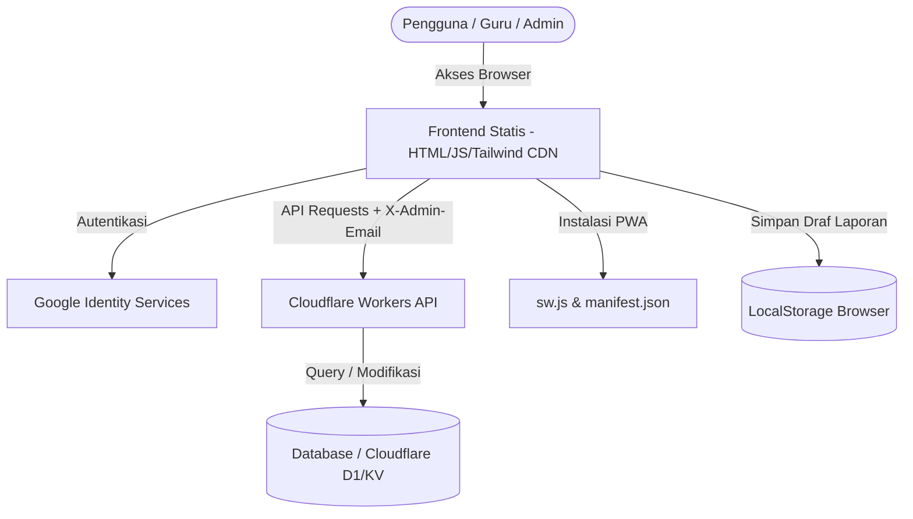

# System Design Document
## Aplikasi Akademik & Absensi LKP Insan Jaya

---

## 1. Arsitektur Sistem

Aplikasi LKP Insan Jaya menggunakan arsitektur **Jamstack** (Client-side Rendering) yang dipadukan dengan **Serverless Backend**:



*   **Frontend Layer**: Terdiri dari file-file HTML statis yang memanggil Tailwind CSS melalui script CDN. Logika fungsionalitas dan manipulasi DOM ditangani langsung menggunakan Vanilla JS.
*   **Database & API Layer**: Serverless backend di Cloudflare Workers mengelola semua permintaan data (baca/tulis) dan bertindak sebagai perantara database yang aman.
*   **State & Storage Layer**:
    *   `localStorage` digunakan untuk menyimpan data profil pengguna yang login (`lkp_user_email`, `lkp_user_name`, `lkp_user_picture`) serta menyimpan draf laporan belajar bulanan secara lokal.
    *   Database serverless menyimpan data permanen seperti profil siswa, catatan kehadiran, dan data pendaftar online.

---

## 2. Struktur Komponen Frontend (Halaman)

### A. Login (`index.html`)
*   Memuat SDK Google Identity Services (`https://accounts.google.com/gsi/client`).
*   Menginisialisasi tombol login dengan metode `google.accounts.id.initialize` dan `google.accounts.id.renderButton`.
*   Mendekode JWT Token dari Google menggunakan fungsi kustom `parseJwt()` untuk mendapatkan email dan profil pengguna, lalu menyimpannya ke `localStorage`.

### B. Dashboard (`dashboard.html`)
*   Mengambil data seluruh siswa dari `/api/data` menggunakan fungsi `fetchWithAuth()`.
*   Merender data ke tabel desktop atau tampilan kartu lipat pada perangkat seluler.
*   Menangani logika pencarian dan filter bertingkat menggunakan fungsi JavaScript array (`filter()`).
*   Menyediakan formulir modal untuk mengubah data profil siswa (dikirim via POST ke `/api/edit`) dan menghapus data siswa (dikirim via POST ke `/api/delete`).

### C. Lembar Presensi Siswa (`absensi-siswa.html`)
*   Mengelompokkan data siswa secara dinamis dalam bentuk struktur objek JS: `Program` -> `Instruktur/Guru` -> `Nama Siswa`.
*   Memiliki menu opsi *Format Absen* (8 atau 12 pertemuan) yang secara dinamis menambah/mengurangi baris tabel absensi secara real-time.
*   Memuat riwayat kehadiran siswa yang dipilih dari `/api/get-absensi-siswa?siswa_id=...` dan menyimpannya kembali ke `/api/save-absensi-siswa` saat guru mengeklik tombol simpan.
*   Menyediakan kontrol khusus untuk status pembayaran SPP (hanya aktif untuk Super Admin).

### D. Pendaftaran Siswa Baru (`pendaftaran.html`)
*   Menampilkan formulir input data lengkap siswa baru (biodata, kontak, data orang tua/wali).
*   Menyediakan generator jadwal dinamis:
    *   Opsi Jadwal Standar (misal: Senin & Rabu).
    *   Opsi Jadwal Kustom (menyediakan checkbox Hari dan input teks Jam Masuk & Jam Keluar).
*   Mengirimkan data pendaftaran ke `/api/submit` dan menyimpan metadata kelas baru ke `/api/kelas`.

### E. Rekapitulasi Online (`rekap-online.html`)
*   Mengambil data pendaftaran dari form publik luar via `/api/pendaftaran-online`.
*   Menampilkan detail formulir di dalam modal interaktif.
*   Menyediakan tombol kontrol untuk memperbarui status pendaftar (`/api/pendaftaran-online/status`) atau menghapus pendaftar (`/api/pendaftaran-online/delete`).

### F. Generator Laporan Belajar (`laporan.html`)
*   Menyediakan input kompetensi per baris (Materi, Kondisi, dan Hasil Pembelajaran) hingga maksimal 8 baris.
*   Menggunakan fungsi `adjustPreviewScale()` untuk melakukan scaling responsive (`transform: scale(...)`) pada lembar pratinjau A4 agar pas dengan lebar layar pengguna.
*   Memanggil library **`dom-to-image`** (`domtoimage.toJpeg`) untuk merender elemen HTML `#report-container` menjadi gambar JPG berkualitas 100% dengan resolusi A4 presisi (794 x 1123 px).

---

## 3. Desain Keamanan & Hak Akses

Otorisasi pengguna didasarkan pada email yang masuk dan divalidasi di dua tingkat:

### 1. Keamanan Sisi Klien (Frontend Navigation)
Halaman web secara dinamis menyembunyikan atau menampilkan elemen navigasi dan tombol aksi berdasarkan kecocokan email pengguna di `localStorage` dengan daftar email yang diizinkan (hardcoded):

*   **Super Admin**: `['lpkinsanjaya@gmail.com', 'yumenoboken@gmail.com']`
*   **Admin/Staff**: `['lpkinsanjaya@gmail.com', 'yumenoboken@gmail.com', 'elsasidamawarniut@gmail.com', 'zilisaje@gmail.com']`
*   **Guru/Instruktur**: Memiliki daftar email lengkap (12 email diizinkan untuk presensi & laporan).

Jika pengguna mencoba membuka halaman yang bukan haknya secara paksa via URL (misalnya `rekap-online.html` dibuka oleh Guru), skrip proteksi di halaman tersebut akan menampilkan `alert("Akses Ditolak")` dan mengarahkan kembali ke dashboard.

### 2. Keamanan Sisi Server (Backend API)
Setiap permintaan modifikasi data (POST) atau pengambilan data sensitif wajib mengirimkan header tambahan:
*   `X-Admin-Email`: Berisi alamat email pengguna yang sedang aktif di client-side.
Backend Cloudflare Workers akan memverifikasi email tersebut sebelum menjalankan kueri database. Jika email tidak terdaftar sebagai admin/staf, server akan mengembalikan respon status **`403 Forbidden`**.

---

## 4. Skema Integrasi Data (JSON payload)

### Payload Penyimpanan Absensi (`POST /api/save-absensi-siswa`)
```json
{
  "siswa_id": 123,
  "format_absen": 12,
  "status_spp": "Lunas",
  "pertemuan": [
    { "pertemuan_ke": 1, "tanggal": "2026-06-01", "status": "Hadir" },
    { "pertemuan_ke": 2, "tanggal": "2026-06-03", "status": "Izin" }
  ]
}
```

### Payload Pengeditan Siswa (`POST /api/edit`)
```json
{
  "id": 123,
  "nama_siswa": "AHMAD DANI NEW",
  "program": "bimbel",
  "kelas": "Kelas 5",
  "guru": "Muhammad Khalid",
  "jadwal": "Senin, Rabu (15:30-17:00)"
}
```

---

## 5. Konfigurasi Progressive Web App (PWA)

Aplikasi didaftarkan sebagai PWA agar dapat dipasang langsung di HP Android/iOS maupun komputer:

1.  **Web App Manifest (`manifest.json`)**:
    Menentukan bagaimana aplikasi muncul ketika diinstal (nama aplikasi, warna tema `#7c3aed`, warna latar belakang `#f8fafc`, mode tampilan `standalone`, dan ikon berukuran `192x192` & `512x512`).
2.  **Service Worker (`sw.js`)**:
    Menyediakan listener untuk event `install` dan `fetch` dasar. Saat ini penanganan caching masih bersifat kosong/pasif untuk sekadar memenuhi persyaratan kelayakan instalasi PWA di peramban Google Chrome.
