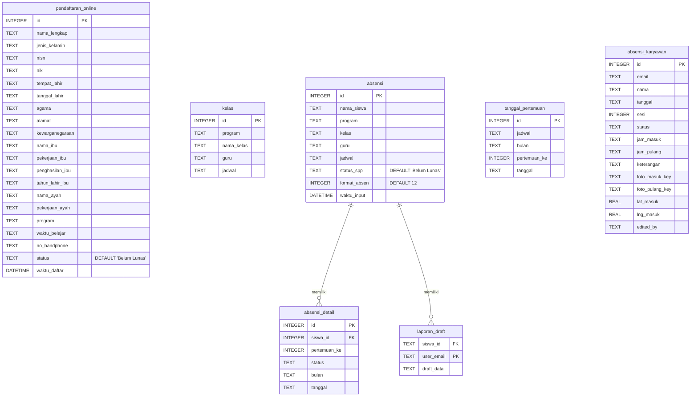

# Entity Relationship Diagram (ERD) - LKP Insan Jaya

Berikut adalah struktur basis data (ERD) dari aplikasi LKP Insan Jaya beserta relasi antar tabelnya, berdasarkan implementasi backend (Cloudflare D1 Worker).

## Penjelasan Tabel Utama

1. **pendaftaran_online**: Tabel yang menyimpan data registrasi siswa baru dari formulir pendaftaran mandiri.
2. **kelas**: Menyimpan master data kelas beserta program, nama kelas, guru pengajar, dan jadwal belajarnya.
3. **absensi** (Data Siswa Aktif): Menyimpan identitas siswa yang sudah aktif belajar beserta kelas dan tagihan SPP-nya. Bertindak sebagai tabel master untuk data akademik siswa.
4. **absensi_detail**: Menyimpan rekam jejak presensi/kehadiran siswa pada setiap sesi pertemuan (1-12 atau 1-8).
5. **tanggal_pertemuan**: Menyimpan catatan tanggal riil dari setiap pertemuan (pertemuan 1 tanggal sekian, pertemuan 2 tanggal sekian) berdasarkan sebuah jadwal.
6. **absensi_karyawan**: Menyimpan rekam jejak presensi harian karyawan lengkap dengan koordinat lokasi (GPS), foto bukti kehadiran, jam masuk, jam pulang, dan status (Hadir, Izin, Sakit, Alpha).
7. **laporan_draft**: Tabel sementara (temp) untuk menyimpan isian draf *Laporan Hasil Belajar* sebelum disubmit secara permanen.
